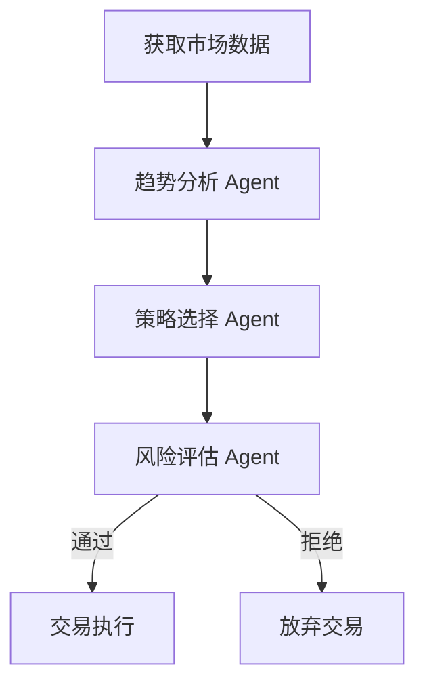
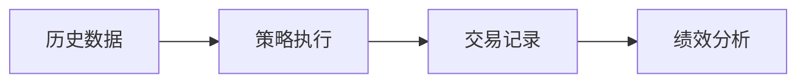

> 作者：量化系统研发 10+ 年从业者
> 
> 定位：一篇可直接照着实现的技术实战文，而不是概念堆砌

---

## 写在前面：先说清楚，这套系统能做到什么

本文目标不是打造“全自动赚钱机器”，而是帮助你从零搭建抛砖引玉的指南：

- ✅ 可真实运行的量化交易系统
    
- ✅ 包含回测、模拟盘、实盘的完整闭环
    
- ✅ 支持 Agent 决策与策略自动生成
    
- ✅ 可在本地或云服务器部署
    

技术组合核心：

- LangGraph：用于构建可控交易决策流程
    
- 大模型：辅助策略生成与分析（而非直接下单）
    
- 传统量化引擎：确保交易逻辑稳定可靠
    

---

## 一、量化系统真实架构设计

### 1.1 推荐系统整体结构

```
┌──────────────────────────────┐
│        Web 管理面板         │
│ 策略配置 / 回测结果 / 日志  │
└──────────────┬───────────────┘
               │ REST API
┌──────────────▼───────────────┐
│      策略调度服务 FastAPI   │
└──────────────┬───────────────┘
               │
┌──────────────▼───────────────┐
│   LangGraph 决策工作流引擎  │
│ 策略分析 / 风控 / 决策链    │
└──────────────┬───────────────┘
               │
┌──────────────▼───────────────┐
│     传统量化执行模块        │
│ Backtrader / vectorbt        │
└──────────────┬───────────────┘
               │
┌──────────────▼───────────────┐
│      交易所 API 接口        │
│ Binance Testnet / OKX 模拟  │
└──────────────────────────────┘
```

特点说明：

- AI 负责“辅助决策”，核心执行仍由稳定代码负责
    
- 回测与实盘使用同一套策略逻辑
    
- 可逐步替换人工策略为 Agent 自动生成
    

---

## 二、技术选型

| 模块       | 技术方案               | 说明          |
| -------- | ------------------ | ----------- |
| 后端主语言    | Python 3.10        | 社区成熟，量化生态完整 |
| Agent 框架 | LangGraph          | 可控流程编排      |
| Web 框架   | FastAPI            | 高性能 API 服务  |
| 回测引擎     | Backtrader         | 经大量项目验证     |
| 行情数据     | ccxt + binance API | 支持实盘和测试网    |
| 数据库存储    | PostgreSQL + Redis | 时序+缓存       |
| 部署       | Docker + Linux     | 标准生产环境      |

---

## 三、系统核心模块拆解

|模块|功能|
|---|---|
|Data Service|获取K线、Ticker、深度|
|Strategy Engine|策略逻辑处理|
|LangGraph Agent|分析与决策层|
|Risk Manager|风控规则|
|Order Executor|下单执行|
|Monitor|状态监控|

---

## 四、LangGraph 在量化中的真实用法

注意：LangGraph 并不是用来直接“预测价格”，而是用来：

- 根据市场状态选择策略
    
- 调整参数
    
- 决定是否交易
    

### 4.1 真实可实现的 Agent 流程



### 4.2 简化可执行代码示例

```python
from langgraph.graph import StateGraph

def market_analysis(state):
    price = state['price']
    if price > state['ma20']:
        return {"trend": "up"}
    return {"trend": "down"}

def strategy_decision(state):
    if state['trend'] == 'up':
        return {"action": "buy"}
    return {"action": "wait"}

builder = StateGraph()
builder.add_node("market", market_analysis)
builder.add_node("decision", strategy_decision)
builder.set_entry_point("market")
builder.add_edge("market", "decision")
workflow = builder.compile()
```

---

## 五、真实案例：BTC 15分钟均线突破策略

### 策略逻辑

- 使用 Binance BTCUSDT 15m K线
    
- short MA = 10
    
- long MA = 30
    

交易规则：

- MA10 上穿 MA30 买入
    
- MA10 下穿 MA30 卖出
    

### 核心 Backtrader 实现

```python
class SmaCross(bt.Strategy):
    params = (('pfast', 10), ('pslow', 30))

    def __init__(self):
        sma1 = bt.ind.SMA(period=self.p.pfast)
        sma2 = bt.ind.SMA(period=self.p.pslow)
        self.crossover = bt.ind.CrossOver(sma1, sma2)

    def next(self):
        if not self.position:
            if self.crossover > 0:
                self.buy()
        elif self.crossover < 0:
            self.sell()
```

该策略可在 Binance Testnet 完整运行。

---

## 六、回测系统流程



关键指标：

|指标|说明|
|---|---|
|年化收益率|Annual Return|
|最大回撤|Max Drawdown|
|Sharpe|夏普比|
|交易次数|Trades|

---

## 七、实盘接入步骤

### 7.1 使用 Binance Testnet

1. 注册 Binance Testnet
    
2. 获取 API Key
    
3. 使用 ccxt 调用接口
    

```python
import ccxt
exchange = ccxt.binance({
    'apiKey': 'YOUR_KEY',
    'secret': 'YOUR_SECRET',
    'options': {'defaultType': 'future'}
})
exchange.set_sandbox_mode(True)
```

---

## 八、项目目录结构

```
quant_system/
├── src/
│   ├── agents/
│   ├── strategies/
│   ├── backtest/
│   ├── execution/
│   ├── data/
│   └── api/
├── config/
├── logs/
└── main.py
```

---

## 九、从 0 到 1 实操路线

|阶段|任务|
|---|---|
|1|手写 SMA 策略|
|2|完成 Backtrader 回测|
|3|接入 Binance Testnet|
|4|加入 LangGraph 决策层|
|5|自动策略生成与调参|

---

## 十、常见问题与经验

|问题|实战建议|
|---|---|
|系统太复杂|优先稳定策略|
|AI 误判|加强规则限制|
|实盘亏损|降低仓位|
|频繁交易|增加冷却时间|

---

## 结语

量化系统不是“预测机器”，而是一个：

- 严格执行规则
    
- 可持续优化
    
- 数据驱动决策的系统工程
    

LangGraph 帮助你把复杂逻辑拆解成清晰可控的决策流程，而不是黑盒模型。

如果你能把每一笔交易背后的逻辑写清楚，你就已经超过市场上 80% 的所谓“量化玩家”。

---

## 后续可扩展方向

- 自动参数优化 Agent
    
- 多策略组合引擎
    
- 风险动态分配系统
    
- 策略打分与淘汰机制
    

---

