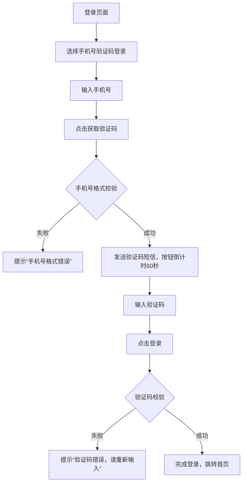

在当前AI工具迭代的浪潮中，不少技术从业者和团队都会陷入这样的困境：

- 依赖Prompt驱动AI输出，结果一致性极差，优质效果难以复现，本质上就是“盲盒式”使用，无法满足生产级场景需求；
    
- 面对复杂业务任务，即便撰写数百字甚至上千字的提示词，仍难以让AI精准对齐需求边界，反复调试成本极高；
    
- 不同业务场景下的AI能力无法复用，每次新任务都要从零开始调教，团队经验无法沉淀，效率始终上不去。
    

如果你的团队正被这些问题困扰，那么Anthropic在Claude Code中推出的Skills能力模块，就是破解上述痛点的关键抓手。不同于单纯的“一句话指令”式Prompt，Skills是可复用、可组合、可沉淀的AI能力资产，它的核心价值，是推动使用者从“被动喂指令的工具使用者”，升级为“主动搭系统的架构设计者”。

作为长期深耕AI架构设计与落地的从业者，本文将从技术本质、核心结构、实战落地、进阶优化四个维度，用通俗易懂的语言+可直接复用的方案，带大家彻底吃透Skills，真正让AI能力服务于生产效率提升。

# 一、Skills的技术本质：生产级AI能力的标准化载体

要真正理解Skills，不必陷入复杂的技术术语堆砌，我们可以用一个贴近职场协作的场景做类比，快速建立认知：

> Prompt = 对新入职员工的临时口头指令（比如“帮我写个活动方案”），指令有效性依赖当下语境，沟通结束后，指令对应的执行逻辑就丢失了； 
> 
> Skills = 公司标准化的SOP作业手册，里面明确了“写方案的核心流程、输出模板、审核标准、常见问题规避”，员工随时可查阅、复用，无需每次重复沟通； 
> 
   MCP（Model Context Protocol）= 员工的系统访问权限，通过授权接入公司数据库、文件服务器、业务系统，让方案输出有真实数据和业务场景支撑，而非空中楼阁。

从技术架构视角来看，Skills的核心价值，在于解决了AI能力在生产环境中“复用性差、稳定性不足、可扩展性弱”的三大核心痛点，其具备三个不可替代的关键特性：

## 1. 能力沉淀：从“对话级临时能力”到“系统级可复用资产”

传统Prompt驱动的AI能力，本质上是绑定在单轮对话上下文之中的，对话窗口关闭、上下文清空，对应的能力就彻底丢失了。而Skills的设计核心，就是打破这种“一次性”限制——它以独立文件夹为载体，脱离具体对话场景存在，是可长期沉淀的数字资产。

在实际工作中，我们可以将高频重复的业务任务，全部封装为独立的Skills模块，比如：产品侧的“PRD生成”“需求评审意见输出”；研发侧的“代码Review”“单元测试用例生成”“报错日志分析”；运营侧的“用户反馈聚类分析”“活动文案优化”。后续无论哪个团队成员需要处理同类任务，直接调用对应的Skill即可，无需重新编写提示词、重复调试逻辑，大幅降低团队协作成本。

## 2. 结构化设计：渐进式披露，降低模型认知负荷

做过大模型落地的同学都清楚，模型的“执行精度”与上下文Token长度强相关——输入信息越杂乱、无效信息占比越高，模型的注意力越分散，越容易出现执行偏差（也就是我们常说的“模型走神”）。

Skills采用“渐进式披露”的核心设计，完美解决了这一问题，其核心逻辑是“按需加载信息，避免信息过载”，具体分为三个层级：

1. 元信息加载：优先加载Skill的名称、核心描述，让模型快速识别“该能力的适用场景、能解决什么问题”，无需加载冗余信息；
    
2. 核心流程加载：当模型判断当前任务需要调用该Skill时，再加载详细的执行步骤、输出规范等核心内容；
    
3. 附属资源加载：若任务执行需要依赖模板、脚本、参考文档等资源，再按需加载对应的附属文件，最大化节省Token资源。
    

这种分层加载的设计，不仅有效控制了上下文长度，让模型注意力更集中、执行更精准，同时也提升了Skill的运行效率，尤其适用于复杂任务的拆解执行。

## 3. 可组合性：能力积木化，支撑复杂任务流落地

单个Skill的定位，是解决某一类具体的、单一的业务问题；而多个Skill的组合，就能支撑起复杂业务任务的全流程自动化落地——这也是AI Agent架构的核心设计思想：Skill作为基础能力积木，Agent作为调度中枢，通过组合不同积木，完成复杂场景的闭环交付。

以“生成一份电商平台月度销售数据分析报告”为例，我们可以将其拆解为三个独立Skill的组合调度：

- data-collection-skill：通过MCP授权接入电商业务数据库，提取月度销售原始数据（订单量、客单价、品类销量等）；
    
- data-cleaning-skill：对原始数据进行去重、补全、异常值处理，输出标准化的分析数据集；
    
- report-generate-skill：基于标准化数据集，按预设模板生成包含可视化图表、核心结论、优化建议的分析报告。
    

通过这种积木化组合，我们无需为每个复杂任务单独设计Prompt，只需复用已有Skill、优化调度逻辑，就能快速实现新任务的自动化落地。

# 二、Skills的核心结构：一个文件夹，就是一套标准化能力包

很多同学初次接触Skills时，会觉得“配置复杂”，但本质上，Skills就是一套符合规范的文件夹结构——核心是“一个必选核心文件+若干可选辅助文件”，无论你使用的是Claude Code、OpenCode，还是其他兼容Skills规范的工具，都必须遵循这套基础结构。下面我们逐一拆解，让大家清楚每个部分的作用与配置规范。

## 1. 文件夹命名规范（硬性要求）

文件夹名称是Skill的唯一标识，工具会通过文件夹名称识别Skill，因此必须严格遵循以下规范：

1. 仅支持小写字母+连字符（-）组合，禁止使用空格、大写字母、数字、特殊符号； 2. 命名需简洁明了，能直观体现Skill的核心功能，避免无意义命名； 示例：prd-writer-skill（PRD生成技能）、error-log-fix-skill（报错日志修复技能）； 反例：PRDWriterSkill（大写字母）、error log fix（空格）、error_log_fix（下划线）——均无法被工具识别。

## 2. 必选核心文件：SKILL.md（Skill的“身份证+操作手册”）

SKILL.md是Skills的核心中的核心——没有这个文件，工具就无法识别该文件夹为Skill，更无法调用其能力。该文件包含两个核心部分：YAML头部（元信息）+ Markdown主体（执行指南），两者缺一不可。

### （1）YAML头部：Skill的元信息（必需，工具识别关键）

YAML头部用三个短横线（---）包裹，包含两个必填字段（name、description），是工具识别Skill的“身份证”，核心作用是告诉工具“这个Skill叫什么、能做什么、适用于什么场景”。

标准配置示例：

```yaml
---
name: prd-writer-skill  # 必须与文件夹名称完全一致，不可修改
description: 用于生成互联网产品功能需求文档（PRD），支持输入功能名称、核心目标、用户场景，输出符合行业规范的标准化PRD文档，包含文档信息、功能背景、核心流程、功能细节、非功能需求等模块
---
```

这里有两个关键注意点，很多同学容易踩坑，需要重点关注：

- description字段必须使用第三人称表述，禁止出现“我”“你”等主观称谓——因为该描述会被注入到工具的系统提示中，视角不一致会导致模型调用逻辑混乱；
    
- description中需包含核心触发关键词（如“PRD”“报错日志”“数据分析”），让模型能根据用户需求，精准判断是否需要调用该Skill。
    

### （2）Markdown主体：Skill的执行指南（模型执行依据）

这部分是给模型看的“操作手册”，核心作用是明确“模型该如何执行任务、输出什么格式、有哪些注意事项”。为了让模型快速理解、避免执行偏差，建议采用标准化结构，包含“指令、示例、注意事项”三个模块，以下是完整示例：

````markdown
# PRD生成技能操作手册

## 一、指令（Instructions）
1.  接收用户输入的核心信息，必须包含：功能名称、核心目标、目标用户、核心场景；
2.  严格按照以下固定结构生成PRD文档，不得遗漏核心模块：
    - 文档信息（版本、作者、创建日期、更新记录）；
    - 功能背景与目标（业务背景、核心目标、量化指标）；
    - 核心功能流程（文字描述+Mermaid流程图，清晰体现用户操作与系统响应逻辑）；
    - 功能细节（核心字段说明、交互逻辑、异常场景处理）；
    - 非功能需求（性能指标、兼容性要求、安全要求）；
3.  输出格式统一为Markdown，流程图使用Mermaid语法，字段说明采用表格形式，确保可读性。

## 二、示例（Examples）
### 输入信息
功能名称：用户手机号验证码登录模块
核心目标：简化用户登录流程，提升新用户注册转化率（目标转化率提升15%）
目标用户：新注册用户、忘记密码用户
核心场景：用户APP登录时，选择手机号验证码登录，输入手机号后获取验证码，验证通过后完成登录

### 输出结果
# 产品需求文档（PRD）- 用户手机号验证码登录模块
## 一、文档信息
| 模块名称 | 用户手机号验证码登录模块 | 版本 | V1.0 |
|----------|--------------------------|------|------|
| 作者     | AI助手（基于prd-writer-skill生成） | 创建日期 | 2026-01-20 |
| 更新记录 | 无                       | 适用产品 | 电商APP |

## 二、功能背景与目标
### 1. 业务背景
当前APP登录仅支持账号密码登录，新用户注册后需记忆账号密码，忘记密码后找回流程繁琐，导致新用户登录转化率偏低（当前转化率30%），用户投诉率较高。
### 2. 核心目标
简化用户登录流程，降低新用户登录门槛，将新用户登录转化率提升至45%以上，降低用户投诉率。
### 3. 量化指标
- 新用户登录转化率≥45%；
- 验证码登录功能使用率≥80%；
- 相关用户投诉率降低50%。

## 三、核心功能流程
### 1. 流程描述
1. 用户进入APP登录页面，选择“手机号验证码登录”；
2. 输入手机号，点击“获取验证码”；
3. 系统校验手机号格式，校验通过后发送验证码短信，同时按钮进入60秒倒计时；
4. 用户输入验证码，点击“登录”；
5. 系统校验验证码有效性，校验通过后完成登录，跳转至首页；校验失败则提示“验证码错误，请重新输入”。
### 2. 流程图


## 三、注意事项（Notes）
1.  功能描述需简洁明了，避免使用技术术语，确保产品、研发、测试人员均能理解；
2.  量化指标需明确，避免模糊表述（如“提升转化率”改为“转化率提升15%”）；
3.  异常场景处理需全面，涵盖手机号格式错误、验证码过期、验证码错误等核心场景；
4.  流程图需清晰，仅体现核心流程，避免冗余节点。
````

核心原则：Markdown主体的内容越清晰、越具体，模型的执行精度越高，避免模糊化表述（如“生成详细的PRD”改为“按以下结构生成PRD，包含XX模块，输出格式为XX”）。

## 3. 可选辅助文件：让Skill更贴合实际业务需求

除了必选的SKILL.md，我们还可以在Skill文件夹中添加其他辅助文件，增强Skill的能力，让其更贴合实际业务场景。这些文件并非必需，但合理使用能大幅提升Skill的实用性，常见的辅助文件包括：

- templates/：存放输出模板文件（如PRD模板、周报模板、报告模板），模型可直接调用模板生成内容，确保输出格式统一；
    
- scripts/：存放脚本文件（如数据处理Python脚本、接口调用脚本），适用于需要执行代码逻辑的Skill（如数据清洗、文件转换）；
    
- docs/：存放参考文档（如公司业务规范、行业标准、历史案例），模型可查阅参考文档，让输出更贴合业务实际；
    
- examples/：存放更多示例文件（输入输出成对示例），帮助模型更精准理解业务需求，提升输出一致性。
    

辅助文件的核心作用是“降低模型的决策成本”，让Skill的输出更精准、更贴合团队业务规范，大家可根据实际需求灵活添加。

# 三、实战落地：3步搭建你的第一个Skill，快速见效

理论讲完，最关键的还是落地实践。很多同学担心“配置复杂、上手难度高”，其实只要遵循“先搭建、再优化、后复用”的思路，半小时就能搭建好第一个可用的Skill。下面以“报错日志修复技能（error-log-fix-skill）”为例，基于OpenCode（兼容Claude Skills规范，上手更友好），带大家一步步实操落地。

## 步骤1：环境准备，安装Skill Creator工具

手动编写SKILL.md容易出现格式错误，Anthropic官方开源了“Skill Creator Skill”——一个可以自动生成Skill结构的工具，能大幅降低搭建成本，优先推荐安装使用。

1. 打开OpenCode（或Claude Code），在对话窗口输入以下指令，安装Skill Creator： `安装skill，项目地址：https://github.com/anthropics/skills/tree/main/skills/skill-creator`
    
2. 等待安装完成，工具会提示“Skill已添加成功”（若安装失败，可检查网络连接，或手动下载Skill文件夹放到对应目录）；
    
3. 安装完成后，即可通过对话指令，让AI自动生成Skill的基础结构。
    

## 步骤2：生成Skill骨架，填充业务内容

安装好Skill Creator后，无需手动创建文件夹和文件，直接通过指令让AI生成基础骨架，再根据实际需求优化内容即可。

1. 在OpenCode对话窗口输入以下指令，描述需要创建的Skill： `帮我创建一个名为error-log-fix-skill的技能，核心功能：接收代码报错日志（支持Python、Java、JavaScript语言），输出错误原因分析、核心问题定位、修复方案（含修复代码示例）。要求SKILL.md包含指令、示例、注意事项三个模块，文件夹结构符合Skills规范。`
    
2. AI会自动生成error-log-fix-skill文件夹，包含完整的SKILL.md文件（已填充基础内容）；
    
3. 打开生成的SKILL.md文件，根据团队实际业务场景优化内容：
    
    1. 在“示例”模块，补充团队常见的报错场景（如Python的TypeError、Java的NullPointerException）；
        
    2. 在“注意事项”模块，添加团队代码规范（如修复方案需符合PEP8规范、避免使用过时API）；
        
    3. 若需要，可添加templates/文件夹，存放报错修复报告模板。
        

## 步骤3：部署与调用，验证Skill效果

Skill搭建完成后，只需部署到工具的指定目录，即可调用使用，验证效果。

1. 将error-log-fix-skill文件夹，放到对应工具的Skills全局目录（全局目录下的Skill，所有项目均可调用）：
    
    1. OpenCode（Mac）：/Users/用户名/.config/opencode/skill（需手动创建skill文件夹）；
        
    2. OpenCode（Windows）：C:\Users\用户名\.config\opencode\skill；
        
    3. Claude Code：~/.claude/skills（无需手动创建，工具默认存在）。
        
2. 重启OpenCode（Claude Code支持热重载，无需重启），确保工具识别到新添加的Skill；
    
3. 在对话窗口输入实际的代码报错日志，测试Skill调用效果： `帮我分析并修复这个Python报错：` `TypeError: 'int' object is not subscriptable` `File "test.py", line 5, in <module>` `print(num[0])`
    
4. AI会自动调用error-log-fix-skill，输出标准化的修复结果（示例如下）： **错误原因分析**：变量num被定义为整数类型（int），整数类型不支持下标（[ ]）访问操作，而代码第5行尝试通过num[0]访问元素，导致TypeError报错。 **核心问题定位**：变量类型定义错误，应将num定义为可迭代对象（列表、元组等），而非整数。 **修复方案**： 1. 检查num变量的定义逻辑，确认其预期类型为列表/元组； 2. 修复代码示例（符合PEP8规范）： `# 原错误代码` `num = 123` `print(num[0])` `# 修复后代码` `num = [123, 456] # 将num定义为列表（可迭代对象）` `print(num[0]) # 输出：123`**注意事项**：后续编写代码时，需提前明确变量类型，避免对非可迭代对象使用下标访问。
    

至此，你的第一个Skill就搭建完成并验证通过了。后续可根据实际使用效果，持续优化SKILL.md中的指令、示例和注意事项，让输出更精准。

# 四、进阶优化：让Skills成为团队的“能力资产库”

搭建好第一个Skill后，更重要的是实现“能力沉淀与复用”，让Skills从“个人工具”升级为“团队资产”。结合多年的落地经验，分享三个进阶优化方向，帮助大家最大化Skills的价值。

## 1. 沉淀个人/团队标准化能力模板

梳理团队日常工作中的高频重复任务，将其全部封装为Skill，形成标准化的能力模板库。不同角色可重点沉淀的Skill方向：

- 研发工程师：git-commit-message-skill（规范提交信息）、unit-test-generate-skill（生成单元测试用例）、api-doc-generate-skill（生成接口文档）；
    
- 产品经理：user-story-skill（生成用户故事）、demand-review-skill（输出需求评审意见）、roadmap-plan-skill（生成产品路线图）；
    
- 运营人员：activity-plan-skill（生成活动方案）、user-feedback-analysis-skill（聚类分析用户反馈）、data-report-skill（生成运营数据报告）；
    
- 学生/研究者：essay-outline-skill（生成论文大纲）、literature-summary-skill（文献摘要总结）、data-visualization-skill（生成数据分析图表）。
    

核心原则：每个Skill聚焦一个具体任务，输出标准化、可复用，避免“大而全”的Skill（难以维护、执行精度低）。

## 2. 组合Skill，搭建自动化业务流程

单个Skill解决单一问题，多个Skill组合就能实现复杂业务流程的自动化。以“自媒体内容生成”为例，我们可以搭建一套完整的自动化流程，仅需输入核心主题，即可输出“选题分析+文章初稿+文案优化+封面描述”的全链路内容：

1. hotspot-collect-skill：采集全网热点（通过MCP接入微博、知乎、小红书等平台），筛选与核心主题相关的热点内容；
    
2. topic-select-skill：基于热点内容，生成3-5个优质选题（包含核心角度、目标受众、传播亮点）；
    
3. article-write-skill：根据选定的选题，生成文章初稿（符合自媒体风格，结构清晰）；
    
4. article-polish-skill：优化文章语气、修正语法错误、提升可读性，符合平台传播规范；
    
5. cover-desc-skill：生成小红书/抖音风格的封面文案（包含核心关键词、吸引点）。
    

通过这种组合方式，我们可以将原本需要2-3小时的工作，压缩到10分钟以内，大幅提升工作效率。同时，可基于团队业务需求，灵活调整Skill的组合逻辑，适配不同场景。

## 3. 共享与迭代，打造团队协作能力库

Skills的价值，在于“复用与传承”。将团队沉淀的Skill上传到Git仓库（如GitHub、GitLab），实现团队共享，让新人快速上手，同时建立持续迭代机制，让能力库不断优化。

- 共享机制：将Skill文件夹上传到团队Git仓库，编写README.md，说明每个Skill的功能、使用场景、调用方式，方便团队成员一键安装；
    
- 迭代机制：定期收集团队成员的使用反馈，优化Skill的执行逻辑、示例内容，同时新增高频任务对应的Skill，丰富能力库；
    
- 权限管理：通过Git分支管理，区分“基础Skill”（全员可用）和“业务专属Skill”（特定团队可用），确保能力库的规范性。
    

# 五、总结：AI时代，真正的竞争力是“能力沉淀与复用”

在AI工具日益普及的今天，“会用AI”已经不再是核心竞争力，“能让AI为团队高效赋能、实现能力沉淀与复用”，才是拉开差距的关键。

Skills的核心价值，不在于“新的技术概念”，而在于它提供了一套“生产级AI能力的沉淀与复用方案”——它让AI的能力从临时的对话中解放出来，变成可长期沉淀的数字资产；让复杂任务的实现从“反复写Prompt”变成“搭积木式组合”，降低了AI的使用门槛；让个人和团队的经验从“隐性知识”变成“显性技能”，实现了能力的传承与迭代。

对于技术架构师而言，Skills更是搭建AI驱动型团队的核心抓手——通过标准化的Skill沉淀，让团队的AI能力可管控、可复用、可扩展，真正将AI融入日常生产流程，提升团队整体效率。

最后，建议大家从最高频的任务入手，搭建第一个Skill，逐步沉淀、迭代、组合，让Skills成为你和团队的“核心能力资产库”，在AI时代占据主动。